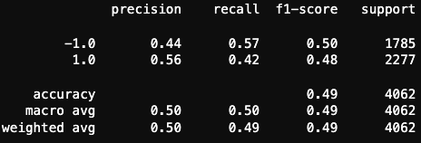

# Machine Learning Trading Bot

In this model, I am planning to improve the existing algorithmic trading systems and maintain the firm’s competitive advantage in the market. To do so, I will enhance the existing trading signals with machine learning algorithms that can adapt to new data.

# Technology

This project uses Python 3.7 and the associated packages:

* [pandas](https://github.com/pandas-dev/pandas) - Flexible and powerful data analysis / manipulation library for Python, providing labeled data structures similar to R data.frame objects, statistical functions, and much more.

* [jupyter notebook](https://jupyter.org/) -J upyterLab is the latest web-based interactive development environment for notebooks, code, and data. Its flexible interface allows users to configure and arrange workflows in data science, scientific computing, computational journalism, and machine learning.

* [sklearn](https://scikit-learn.org/) - Simple and efficient tools for predictive data analysis.Open source, commercially usable - BSD license


Installation Guide

Install the app's dependencies first.

```
  pip install pandas
  pip install -U scikit-learn

```
---
# Useage

Download all the requirement data including Resources folder and machine_learning_trading_bot.ipynb

Run the machine_learning_trading_bot.ipynb with jupyter notebook.


# Analysis for Tuning the data size, sma and classifier. 

I have plotted all the tuned models on actual returns versus the strategy returns.

The original:


Slice 6 months as X_train date:


What impact resulted from increasing or decreasing the training window?
Answer: Increasing the training data window also increases the accuracy to 0.56. So we know adding more data can benefice to the accuracy.

Change sma period(SMA10 and SMA60):


What impact resulted from increasing or decreasing either or both of the SMA windows?
Expanding the short_window and reducing the long_window together drops the accuracy rate to 0.54. So we know we should do it the opposite way, by increasing the distance between the SMA short and long periods.

change model to AdaBoost




Changing the classifier to AdaBooster drops the accuracy rate to 0.49, which makes it worse. So we know the SVM is better.

In conclusion, the best model we can see is the second one.SVM model with bigger data for training.

---

## Contributors
FinTech Team


---

## License

[MIT](https://choosealicense.com/licenses/mit/)