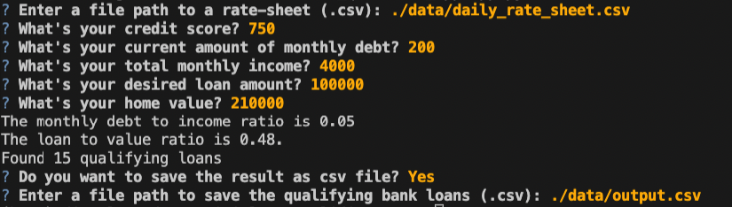
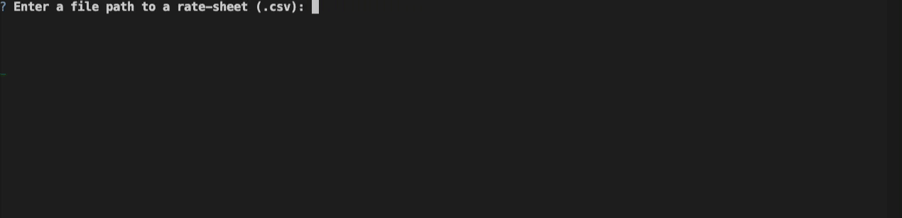

#  Loan Qualifier Application

Users may use this Python command-line interface program to sort qualified loans according to a number of criteria. The program functions by importing a "daily rate sheet" of loan requirements from different loan providers. Users may also decide whether and where to store the lenders' filtered data on qualified loans as a .CSV file.


---

## Technologies

This project uses Python 3.7 and the associated packages:

* [fire](https://github.com/google/python-fire) - For the command line interface, help page, and entrypoint.

* [questionary](https://github.com/tmbo/questionary) - For interactive user prompts and dialogs

---

## Installation Guide

Install the app's dependencies first.

```python
  pip install fire
  pip install questionary
```

---

## Usage

Cloning the repository and running app.py with:

```python
python app.py
```
Upon opening the loan qualifying application, the following prompts will appear.




---

## Contributors

FinTech Team
Author Contact email XXXXX@gmail.com

---

## License

MIT License


