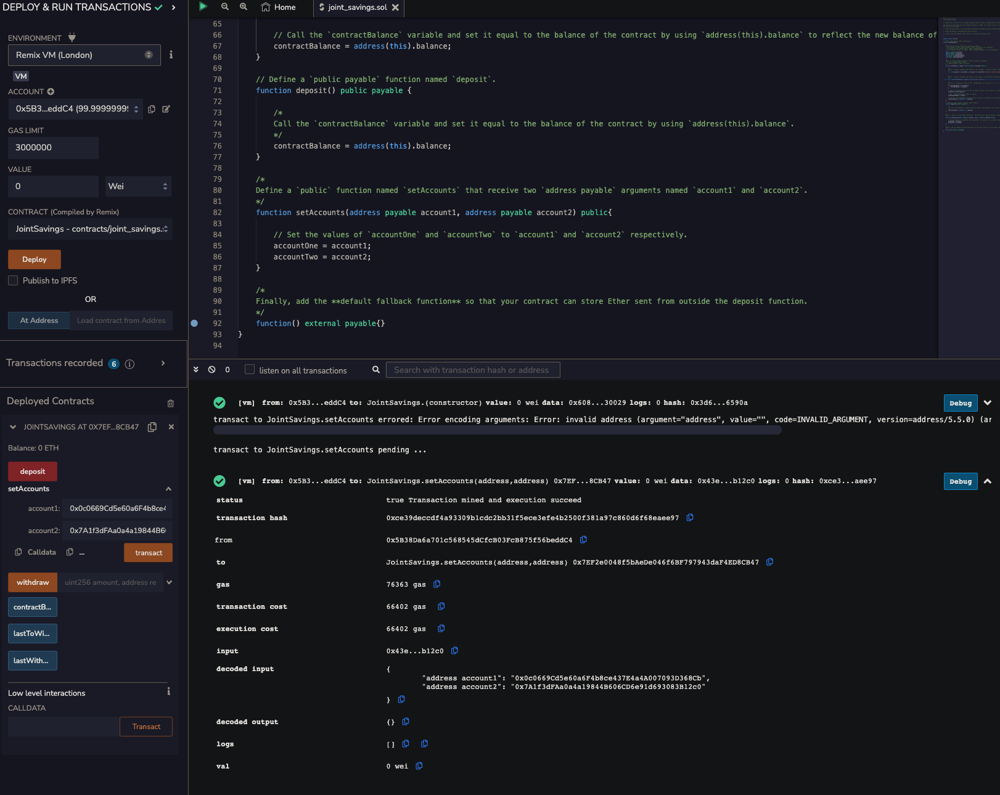
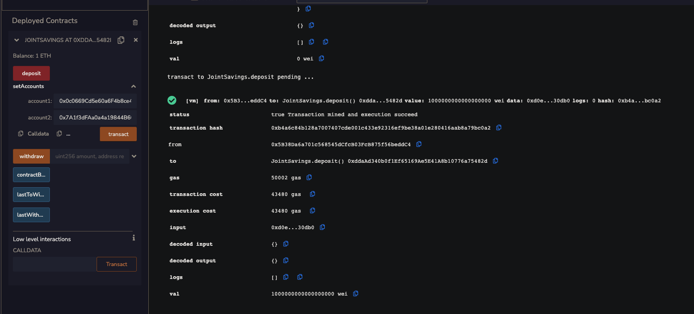
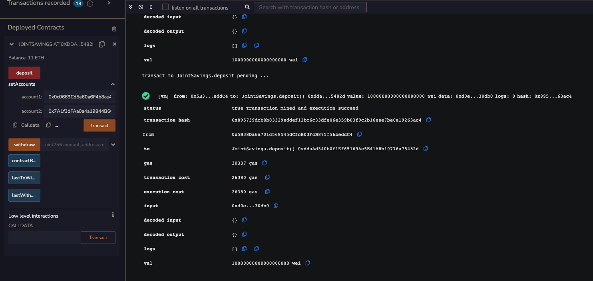
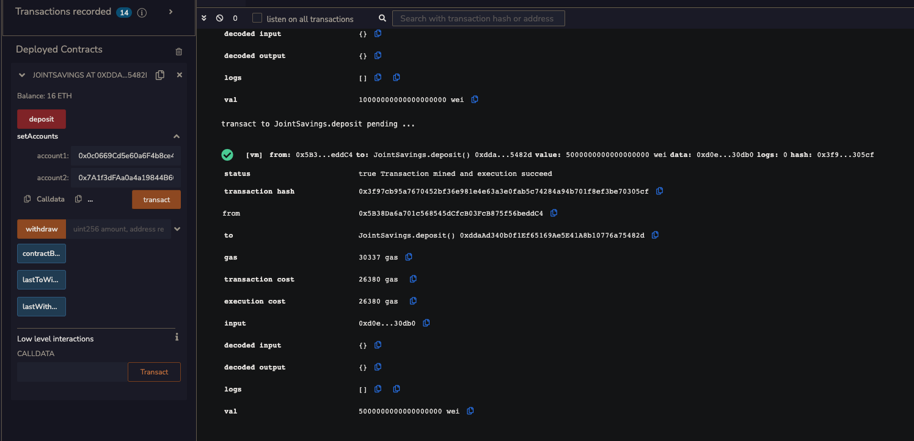
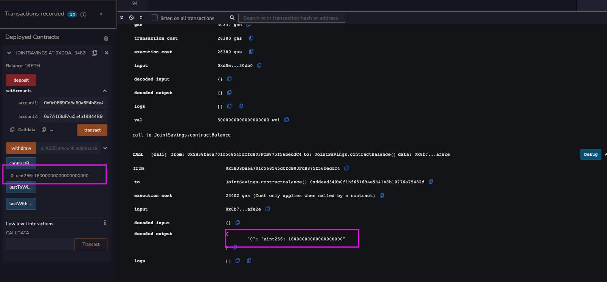
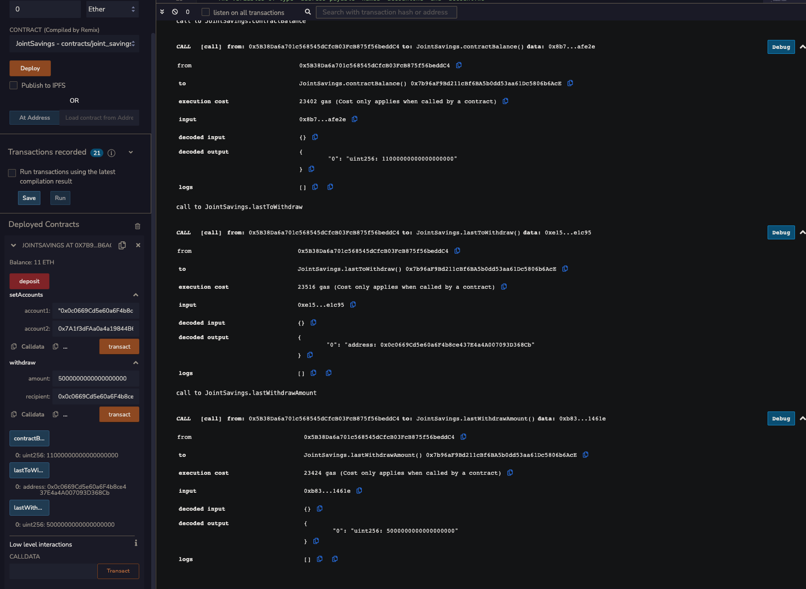
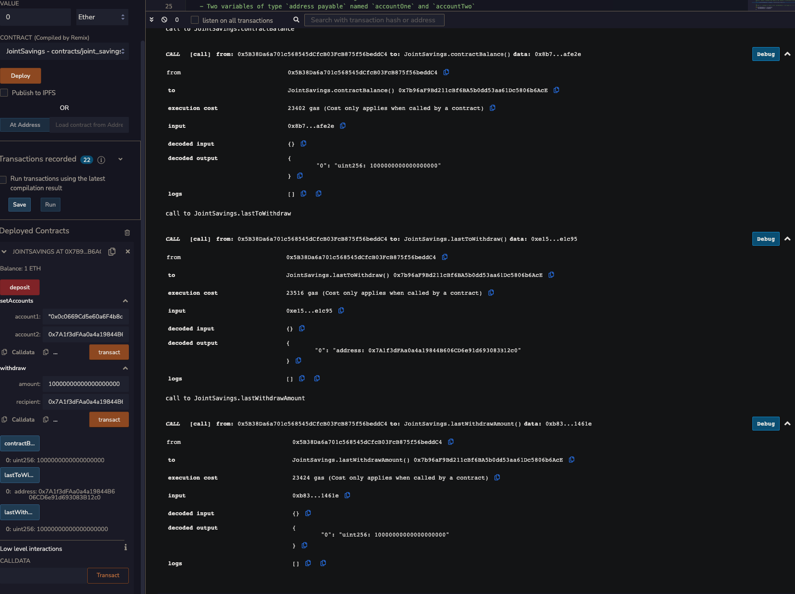

# Pychain

To automate the creation of joint savings accounts, I created a Solidity smart contract that accepts two user addresses. These addresses will be able to control a joint savings account. My smart contract will use ether management functions to implement a financial institution’s requirements for providing the features of the joint savings account. These features will consist of the ability to deposit and withdraw funds from the account.

# Technology

This project uses solidity 0.5.0 :

* [solity](https://docs.soliditylang.org/) - Solidity is an object-oriented, high-level language for implementing smart contracts. Smart contracts are programs which govern the behaviour of accounts within the Ethereum state.

* [Remix Online IDE](remix.ethereum.org) - Remix Online IDE is a powerful toolset for developing, deploying, debugging, and testing Ethereum and EVM-compatible smart contracts.

---

# Show Time

Interact with Deployed Smart Contract:

1.Use the setAccounts function to define the authorized Ethereum address that will be able to withdraw funds from your contract.

2.Test the deposit functionality of your smart contract by sending the following amounts of ether. After each transaction, use the contractBalance function to verify that the funds were added to your contract:

Transaction 1: Send 1 ether as wei.

Transaction 2: Send 10 ether as wei.

Transaction 3: Send 5 ether.

3.test the contract’s withdrawal functionality by withdrawing 5 ether into accountOne and 10 ether into accountTwo. After each transaction, use the contractBalance function to verify that the funds were withdrawn from your contract. Also, use the lastToWithdraw and lastWithdrawAmount functions to verify that the address and amount were correct.

To review the codes, download and open joint_savings.sol

---

## Contributors
FinTech Team

---

## License

[MIT](https://choosealicense.com/licenses/mit/)