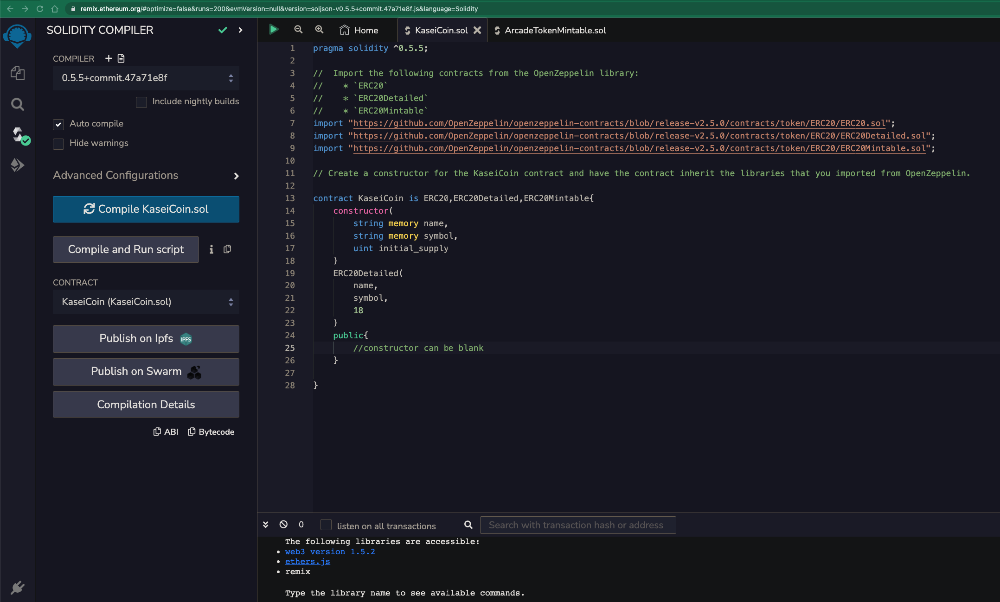
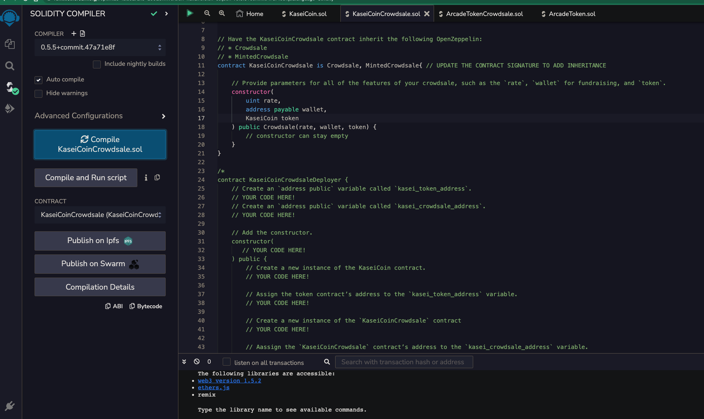
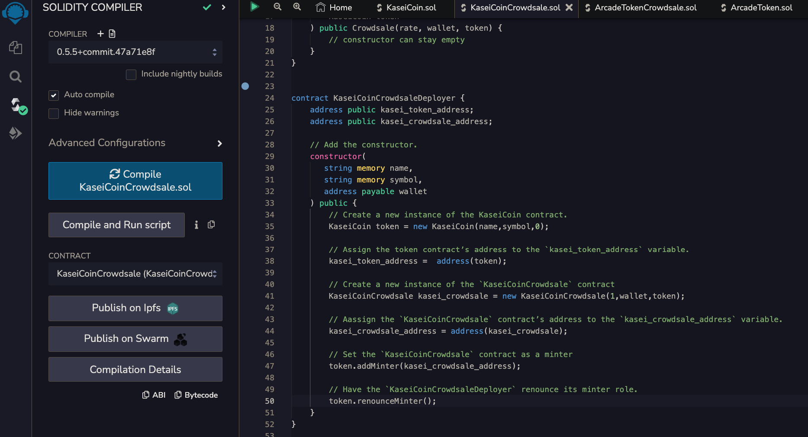

# Application

## Challenge: Martian Token Crowdsale

I crested a fungible token that is ERC-20 compliant and that will be minted by using a `Crowdsale` contract from the OpenZeppelin Solidity library.

The crowdsale contract that I create will manage the entire crowdsale process, allowing users to send ether to the contract and in return receive KAI, or KaseiCoin tokens. My contract will mint the tokens automatically and distribute them to buyers in one transaction.

---

# Technology

This project uses solidity 0.5.0 :

* [solity](https://docs.soliditylang.org/) - Solidity is an object-oriented, high-level language for implementing smart contracts. Smart contracts are programs which govern the behaviour of accounts within the Ethereum state.

* [Remix Online IDE](remix.ethereum.org) - Remix Online IDE is a powerful toolset for developing, deploying, debugging, and testing Ethereum and EVM-compatible smart contracts.

---

### Evaluation Evidence

The steps for this Challenge are divided into the following sections:

1. Create the KaseiCoin Token Contract

1. Create the KaseiCoin Crowdsale Contract
 

1. Create the KaseiCoin Deployer Contract
 

1. Deploy the Crowdsale to a Local Blockchain
 

1. Optional: Extend the Crowdsale Contract by Using OpenZeppelin

Code included in KaseiCoinCrowdsale.sol

---

## Contributors
FinTech Team

---

## License

[MIT](https://choosealicense.com/licenses/mit/)
